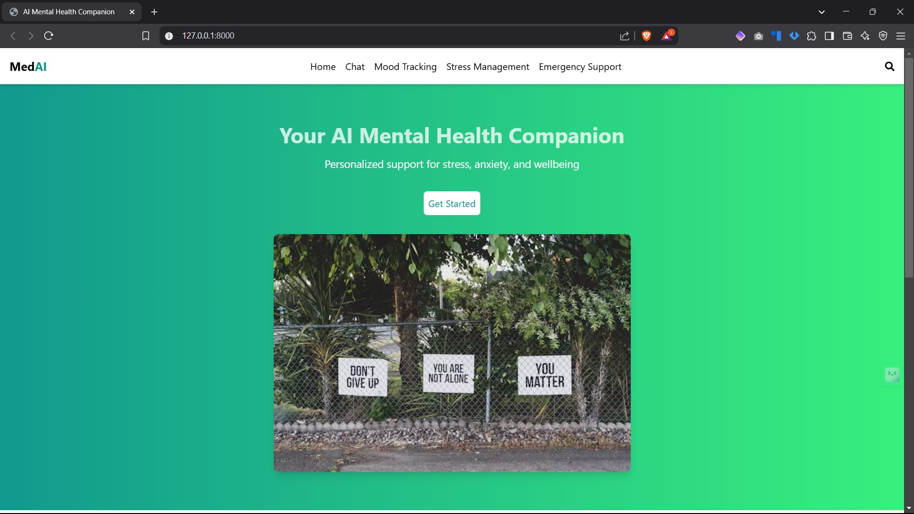
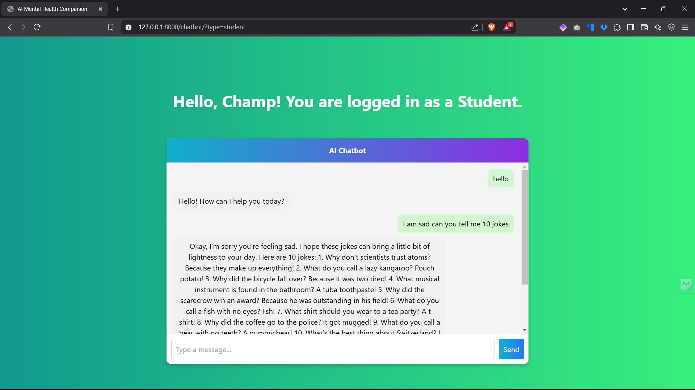
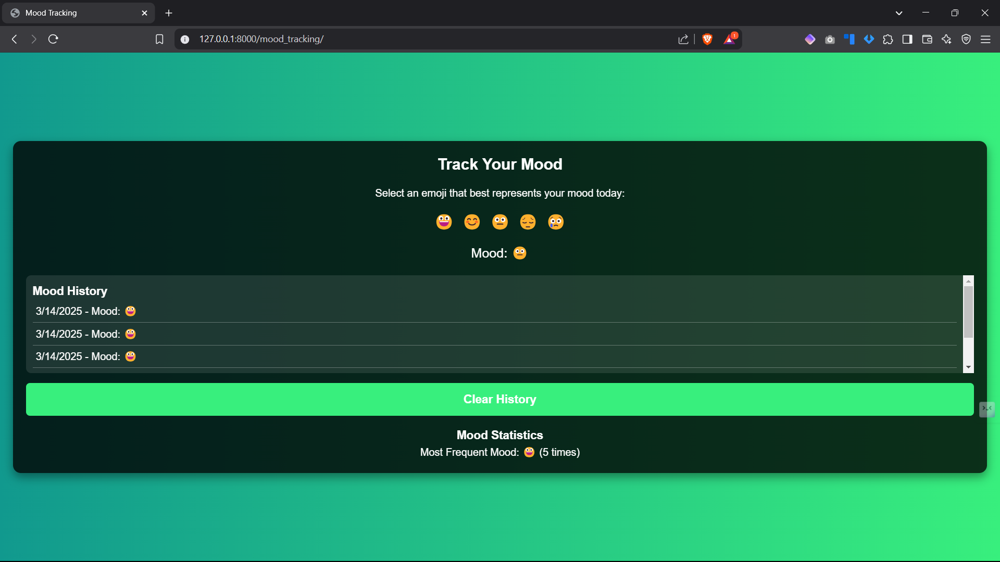
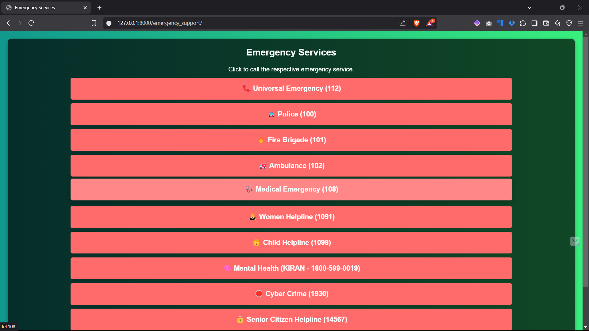

# 🧠 Mental Health Chatbot

## 🌟 Introduction
This is a **Mental Health Chatbot** designed to provide users with **emotional support**, **stress management techniques**, and **Cognitive Behavioral Therapy (CBT)-based interactions**. The chatbot utilizes **AI-driven sentiment analysis** to understand the user's mood and respond accordingly.

---

## ✨ Features
✅ **Mood Recognition**: Detects user's emotions based on input text.  
✅ **Stress Management**: Provides relaxation techniques and breathing exercises.  
✅ **CBT-Based Interactions**: Uses **Cognitive Behavioral Therapy (CBT)** principles to help users manage anxiety and depression.  
✅ **User-Friendly Interface**: Developed using **React.js** for the frontend and **Django** for the backend.  
✅ **Secure & Private**: Ensures confidentiality and user data protection.  
✅ **Emergency Support**: Provides emergency contacts for mental health assistance.  
✅ **Mood Tracker**: Allows users to log and track their emotional patterns.  

---

## 🛠️ Tech Stack
- **Frontend**: ⚛️ React.js  
- **Backend**: 🐍 Django  
- **Database**: 🐘 PostgreSQL  
- **AI/ML**: 🤖 Natural Language Processing (NLP) for sentiment analysis  
- **Deployment**: 🐳 Docker & **CI/CD Pipeline**  

---

## 📥 Installation Guide
### 🔹 Prerequisites
Ensure you have the following installed:
- **Python 3.x**
- **Node.js & npm**
- **PostgreSQL**

### 🖥️ Backend Setup
```bash
# Clone the repository
git clone https://github.com/your-repo/mental-health-chatbot.git
cd mental-health-chatbot/backend

# Create a virtual environment
python -m venv venv
source venv/bin/activate  # On Windows use `venv\Scripts\activate`

# Install dependencies
pip install -r requirements.txt

# Run migrations
python manage.py migrate

# Start the server
python manage.py runserver
```

### 🎨 Frontend Setup
```bash
cd ../frontend

# Install dependencies
npm install

# Start the React development server
npm start
```

---

## 🚀 Usage
- Users can interact with the chatbot through the **web interface**.  
- Users can access **relaxation techniques**, **mood tracking**, and **mental health resources**.  
- The chatbot provides **emergency mental health support contacts** when needed.  

---

## 👨‍💻 Contributors
- **👤 Wagmare Sanjana** - Researcher  
- **👤 B. Ruchilasya** - Researcher  
- **👤 Rangdal Pavansai** - Developer  
- **👤 B. Manish** - Developer  

---

## 📞 Contact
📧 **Wagmare Sanjana**: wagmaresanjana5@gmail.com  
🔗 **LinkedIn**: [Wagmare Sanjana](https://www.linkedin.com/in/wagmare-sanjana)  
🔗 **GitHub**: [Sanjana's GitHub](https://github.com/WAGMARESANJANA)  

📧 **B. Ruchilasya**: bobbiliruchilasya@gmail.com  
🔗 **LinkedIn**: [Bobbili Ruchilasya](https://www.linkedin.com/in/ruchilasya-bobbili-055407292/)   
🔗 **GitHub**: [Ruchilasya's GitHub](https://github.com/Bobbili-Ruchilasya)  
 

📧 **Rangdal Pavansai**: psai49779@gmail.com  
🔗 **GitHub**: [Pavansai's GitHub](https://github.com/Pavansai20054)  
🔗 **LinkedIn**: [Rangdal Pavansai](https://www.linkedin.com/in/rangdal-pavansai)  

📧 **B. Manish**: manishkumarbollapally@gmail.com  
🔗 **LinkedIn**: [Bollapally Manish Kumar](https://www.linkedin.com/in/bollapally-manish-kumar-83981425b/)  
🔗 **GitHub**: [Manish's GitHub](https://github.com/Bollapally-Manish-Kumar)  

---

## 📜 License
📄 This project is licensed under the [MIT License](./LICENSE).

---

## 🖼️ Screenshots
### 🏠 Home Page
  

### 💬 Chat Page
  

### 📊 Mood Tracker Page
  

### 😌 Stress Management Tips Page
  

### 🚨 Emergency Services Page
  

---

## 🤝 Support
If you like this project, ⭐️ it on GitHub!  
If you have any questions or suggestions, feel free to reach out. 💙
